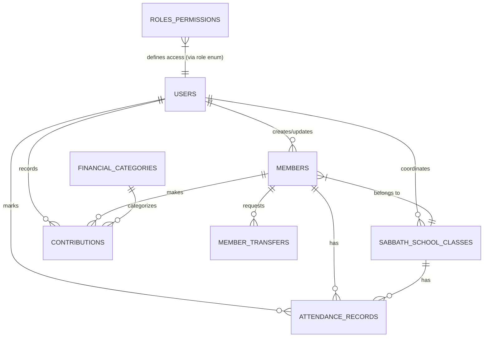

# Church Management System - Database Documentation

## Table of Contents
1. [Introduction](#introduction)
2. [Database Overview](#database-overview)
3. [Entity Relationship Diagram (ERD)](#entity-relationship-diagram-erd)
4. [Table Definitions](#table-definitions)
5. [Relationships & Constraints](#relationships--constraints)
6. [Indexes & Performance](#indexes--performance)
7. [Data Types & Standards](#data-types--standards)

---

## Introduction

This document details the database schema for the Seventh-day Adventist Church Management System. The database is designed to support member management, Sabbath School operations, financial tracking, and role-based access control.

**Database System:** MySQL 8.0+
**ORM:** Laravel Eloquent
**Primary Key Strategy:** UUID (Universally Unique Identifier) v4

---

## Database Overview

The schema is normalized to 3NF (Third Normal Form) to ensure data integrity and reduce redundancy. It uses UUIDs for all primary keys to facilitate potential future distributed architecture or data merging.

### Core Modules
1. **User Management:** Authentication and authorization
2. **Member Management:** Core church membership data
3. **Sabbath School:** Class organization and attendance
4. **Finance:** Contributions and categories
5. **System:** Logs, notifications, and settings

---

## Entity Relationship Diagram (ERD)

---

## Table Definitions

### 1. `users`
System users who can log in to the application.

| Column | Type | Nullable | Default | Description |
|--------|------|----------|---------|-------------|
| `id` | UUID | No | - | Primary Key |
| `first_name` | VARCHAR(255) | No | - | |
| `last_name` | VARCHAR(255) | No | - | |
| `email` | VARCHAR(255) | No | - | Unique, Login ID |
| `role` | ENUM | No | - | 'pastor', 'clerk', 'welfare', 'superintendent', 'coordinator', 'financial', 'ict' |
| `password` | VARCHAR(255) | No | - | Hashed |
| `avatar` | VARCHAR(255) | Yes | NULL | Path to image |
| `active` | BOOLEAN | No | true | Account status |
| `email_verified_at` | TIMESTAMP | Yes | NULL | |
| `last_login` | TIMESTAMP | Yes | NULL | |
| `created_at` | TIMESTAMP | Yes | NULL | |
| `updated_at` | TIMESTAMP | Yes | NULL | |
| `deleted_at` | TIMESTAMP | Yes | NULL | Soft Delete |

**Indexes:** `['email', 'role', 'active']`

---

### 2. `members`
The core registry of church members.

| Column | Type | Nullable | Default | Description |
|--------|------|----------|---------|-------------|
| `member_id` | UUID | No | - | Primary Key |
| `first_name` | VARCHAR(255) | No | - | |
| `middle_name` | VARCHAR(255) | Yes | NULL | |
| `last_name` | VARCHAR(255) | No | - | |
| `family_name` | VARCHAR(255) | Yes | NULL | Grouping key for families |
| `gender` | ENUM | Yes | NULL | 'male', 'female' |
| `phone` | VARCHAR(50) | Yes | NULL | |
| `email` | VARCHAR(255) | Yes | NULL | |
| `address` | TEXT | Yes | NULL | |
| `date_of_birth` | DATE | Yes | NULL | |
| `membership_type` | VARCHAR(50) | Yes | NULL | e.g., 'Regular', 'Student' |
| `membership_category` | VARCHAR(50) | Yes | NULL | e.g., 'Adult', 'Youth' |
| `role_in_church` | VARCHAR(255) | Yes | NULL | |
| `baptism_status` | VARCHAR(50) | Yes | NULL | 'Baptized', 'Not Baptized', 'Pending' |
| `date_of_baptism` | DATE | Yes | NULL | |
| `membership_date` | DATE | Yes | NULL | |
| `membership_status` | ENUM | No | 'active' | 'active', 'inactive', 'transferred', 'archived' |
| `sabbath_school_class_id` | UUID | Yes | NULL | FK to `sabbath_school_classes` |
| `photo` | VARCHAR(255) | Yes | NULL | Path to image |
| `active_disciplinary_record_id` | UUID | Yes | NULL | For future use |
| `created_by` | UUID | Yes | NULL | FK to `users` |
| `updated_by` | UUID | Yes | NULL | FK to `users` |
| `created_at` | TIMESTAMP | Yes | NULL | |
| `updated_at` | TIMESTAMP | Yes | NULL | |
| `deleted_at` | TIMESTAMP | Yes | NULL | Soft Delete |

**Indexes:** `['first_name', 'last_name']`, `family_name`, `membership_status`, `sabbath_school_class_id`, `email`

---

### 3. `sabbath_school_classes`
Groups for weekly Sabbath School study.

| Column | Type | Nullable | Default | Description |
|--------|------|----------|---------|-------------|
| `id` | UUID | No | - | Primary Key |
| `name` | VARCHAR(255) | No | - | Unique |
| `description` | TEXT | Yes | NULL | |
| `coordinator_id` | UUID | Yes | NULL | FK to `users` |
| `age_range` | VARCHAR(50) | Yes | NULL | e.g., '18-35' |
| `active` | BOOLEAN | No | true | |
| `created_at` | TIMESTAMP | Yes | NULL | |
| `updated_at` | TIMESTAMP | Yes | NULL | |
| `deleted_at` | TIMESTAMP | Yes | NULL | Soft Delete |

---

### 4. `attendance_records`
Weekly attendance tracking for Sabbath School.

| Column | Type | Nullable | Default | Description |
|--------|------|----------|---------|-------------|
| `id` | UUID | No | - | Primary Key |
| `member_id` | UUID | No | - | FK to `members` |
| `class_id` | UUID | Yes | NULL | FK to `sabbath_school_classes` |
| `date` | DATE | No | - | |
| `present` | BOOLEAN | No | false | |
| `notes` | TEXT | Yes | NULL | |
| `marked_by` | UUID | Yes | NULL | FK to `users` |
| `created_at` | TIMESTAMP | Yes | NULL | |
| `updated_at` | TIMESTAMP | Yes | NULL | |

**Constraints:** Unique constraint on `['member_id', 'date']` (One record per member per day).
**Indexes:** `['class_id', 'date']`, `member_id`, `date`

---

### 5. `financial_categories`
Types of funds (e.g., Tithe, Offering, Building Fund).

| Column | Type | Nullable | Default | Description |
|--------|------|----------|---------|-------------|
| `id` | UUID | No | - | Primary Key |
| `name` | VARCHAR(255) | No | - | Unique |
| `description` | TEXT | Yes | NULL | |
| `category_type` | VARCHAR(50) | Yes | NULL | 'income', 'expense' |
| `active` | BOOLEAN | No | true | |
| `created_by` | UUID | Yes | NULL | FK to `users` |
| `created_at` | TIMESTAMP | Yes | NULL | |
| `updated_at` | TIMESTAMP | Yes | NULL | |
| `deleted_at` | TIMESTAMP | Yes | NULL | Soft Delete |

---

### 6. `contributions`
Individual financial records.

| Column | Type | Nullable | Default | Description |
|--------|------|----------|---------|-------------|
| `id` | UUID | No | - | Primary Key |
| `member_id` | UUID | No | - | FK to `members` |
| `category_id` | UUID | No | - | FK to `financial_categories` |
| `amount` | DECIMAL(12,2) | No | - | |
| `date` | DATE | No | - | |
| `payment_method` | VARCHAR(50) | Yes | NULL | 'Cash', 'Bank Transfer', etc. |
| `reference_number` | VARCHAR(255) | Yes | NULL | Check # or Transaction ID |
| `notes` | TEXT | Yes | NULL | |
| `recorded_by` | UUID | Yes | NULL | FK to `users` |
| `created_at` | TIMESTAMP | Yes | NULL | |
| `updated_at` | TIMESTAMP | Yes | NULL | |
| `deleted_at` | TIMESTAMP | Yes | NULL | Soft Delete |

**Indexes:** `['date', 'category_id']`, `member_id`

---

### 7. `member_transfers`
Tracks movement of members between classes or churches.

| Column | Type | Nullable | Default | Description |
|--------|------|----------|---------|-------------|
| `id` | UUID | No | - | Primary Key |
| `member_id` | UUID | No | - | FK to `members` |
| `transfer_type` | ENUM | No | - | 'class', 'church' |
| `status` | ENUM | No | - | 'pending', 'completed', 'rejected' |
| `direction` | ENUM | No | 'to' | 'from', 'to' |
| `church_name` | VARCHAR(255) | Yes | NULL | If external transfer |
| `from_class_id` | UUID | Yes | NULL | FK to `sabbath_school_classes` |
| `to_class_id` | UUID | Yes | NULL | FK to `sabbath_school_classes` |
| `transfer_date` | DATE | No | - | |
| `reason` | TEXT | Yes | NULL | |
| `notes` | TEXT | Yes | NULL | |
| `processed_by` | UUID | Yes | NULL | FK to `users` |
| `created_at` | TIMESTAMP | Yes | NULL | |
| `updated_at` | TIMESTAMP | Yes | NULL | |

---

### 8. `role_permissions`
Defines granular access control for each role.

| Column | Type | Nullable | Default | Description |
|--------|------|----------|---------|-------------|
| `id` | UUID | No | - | Primary Key |
| `role` | ENUM | No | - | Unique Key |
| `members_view` | BOOLEAN | No | false | |
| `members_add` | BOOLEAN | No | false | |
| `members_edit` | BOOLEAN | No | false | |
| `members_delete` | BOOLEAN | No | false | |
| `sabbath_school_view` | BOOLEAN | No | false | |
| `sabbath_school_manage` | BOOLEAN | No | false | |
| `sabbath_school_mark_attendance` | BOOLEAN | No | false | |
| `finance_view` | BOOLEAN | No | false | |
| `finance_record` | BOOLEAN | No | false | |
| `finance_reports` | BOOLEAN | No | false | |
| `reports_view` | BOOLEAN | No | false | |
| `reports_export` | BOOLEAN | No | false | |
| `settings_view` | BOOLEAN | No | false | |
| `settings_edit` | BOOLEAN | No | false | |
| `users_view` | BOOLEAN | No | false | |
| `users_manage` | BOOLEAN | No | false | |
| `updated_by` | UUID | Yes | NULL | FK to `users` |
| `created_at` | TIMESTAMP | Yes | NULL | |
| `updated_at` | TIMESTAMP | Yes | NULL | |

---

### 9. `system_notifications`
In-app notifications for users.

| Column | Type | Nullable | Default | Description |
|--------|------|----------|---------|-------------|
| `id` | UUID | No | - | Primary Key |
| `title` | VARCHAR(255) | No | - | |
| `message` | TEXT | No | - | |
| `type` | VARCHAR(255) | No | 'info' | 'info', 'success', 'warning', 'danger' |
| `is_read` | BOOLEAN | No | false | |
| `user_id` | UUID | Yes | NULL | FK to `users` (NULL = global) |
| `action_url` | VARCHAR(255) | Yes | NULL | Link to related resource |
| `created_at` | TIMESTAMP | Yes | NULL | |
| `updated_at` | TIMESTAMP | Yes | NULL | |

---

## Relationships & Constraints

### Foreign Key Policies
- **Cascade Delete:** Used for child records that cannot exist without a parent (e.g., `attendance_records` -> `members`, `system_notifications` -> `users`).
- **Set Null:** Used for optional relationships where preserving history is important (e.g., `sabbath_school_classes.coordinator_id`, `members.sabbath_school_class_id`).
- **Restrict:** Used for critical financial data (e.g., `contributions` -> `financial_categories`).

### Soft Deletes
Implemented on:
- `users`
- `members`
- `sabbath_school_classes`
- `financial_categories`
- `contributions`
- `role_permissions`

This ensures data is never permanently lost from the database immediately, allowing for recovery and audit trails.

---

## Indexes & Performance

Indexes have been strategically placed on columns frequently used in `WHERE`, `ORDER BY`, and `JOIN` clauses:

1. **Search Optimization:** `members(first_name, last_name)`, `members(email)`
2. **Filtering:** `members(membership_status)`, `sabbath_school_classes(active)`
3. **Reporting:** `contributions(date, category_id)`, `attendance_records(class_id, date)`
4. **Authentication:** `users(email, role, active)`

---

## Data Types & Standards

- **UUIDs:** Stored as CHAR(36) strings.
- **Money:** `DECIMAL(12, 2)` for accurate financial calculations (up to 99 billion).
- **Dates:** `DATE` for calendar dates, `TIMESTAMP` for audit logs.
- **Enums:** Used for fixed sets of values (Roles, Gender, Status) to enforce data integrity at the database level.
